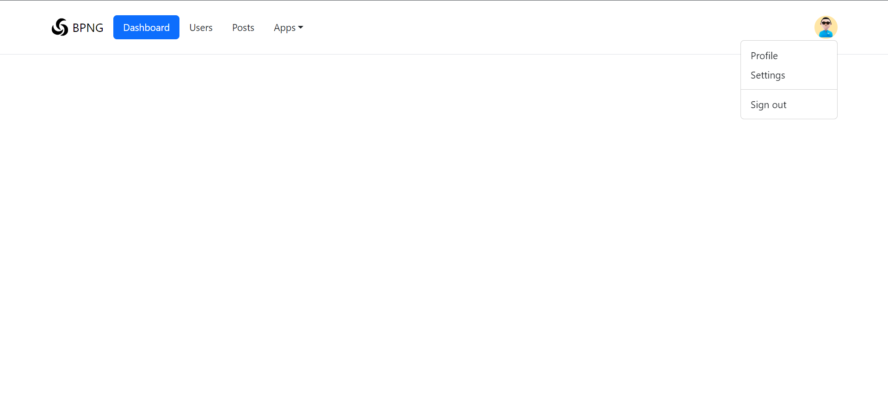

# 🌐 Spring Security Projects

This project was developed with the aim of studying [Spring Security](https://spring.io/projects/spring-security). It was created using [Maven](https://maven.apache.org/) and encompasses various aspects of web application security.

---

## 🎯 Project Objectives

During the development of this project, the following tasks were set and successfully accomplished:

1. Study and installation of dependencies.
2. Implementation of models, view structures, and controls.
3. Creation of a database and connection to it.
4. Creation of roles and user tables.
5. Implementation of password hashing.
6. Study of the [Thymeleaf](https://www.thymeleaf.org/) templating engine and its application.
7. Development of the user interface using [Bootstrap 5](https://getbootstrap.com/).

---

## 📊 Migration Management with [Flyway](https://flywaydb.org/)

In this project, the Flyway library was utilized for managing database migrations. This decision was made for several reasons:

| Reason                                      | Description                                                                                                         |
|---------------------------------------------|---------------------------------------------------------------------------------------------------------------------|
| **Automation of Database Schema Management**| Flyway allows for easy management of changes to the database structure, providing the ability to roll back to previous versions. This is especially useful during development and testing. |
| **Ease of Dependency Management**           | The first migration was created to establish the necessary tables with dependencies, simplifying interaction between various entities of the application. |
| **Data Initialization**                     | The second migration was used to add an administrator to the database, allowing for immediate access to a user with necessary privileges right after deployment. |
| **Simplification of Deployment**            | Using Flyway simplifies the deployment process of the application across different environments, as all migrations are applied automatically. |

---

## ⚙️ Technologies

- **Java**: 22
- **Maven**: 3.8.1 or newer
- **[Spring Boot](https://spring.io/projects/spring-boot)**: 3.3.3
- **[Spring Framework](https://spring.io/projects/spring-framework)**: 6.1.x
- **[PostgreSQL](https://www.postgresql.org/)**: 16

---

## 💡 Features

The project includes the following functionalities:

- User registration
- User login
- User logout

---

## 📑 Templates

The project contains the following templates:

- `Login.html` — Login page
- `Registry.html` — Registration page
- `Home.html` — Home page (before login)
- `Main.html` — Main page (after login)

---

## 🖼️ Screenshots

### Home Page


### Login Page


### Registration Page


### User Main Page after Login


### Admin Main Page after Login


---

## 🚀 Installation

1. Clone this repository:
   ```bash
   git clone https://github.com/WhiteCrowIt/Spring-Security-Projects.git
2. Navigate to the project directory:
    ```bash
   cd Spring-Security-Projects
3. Install the dependencies:
    ```bash
   mvn install
4. Configure the database connection in `application.properties`.
5. Run the project:
    ```bash
   mvn spring-boot:run